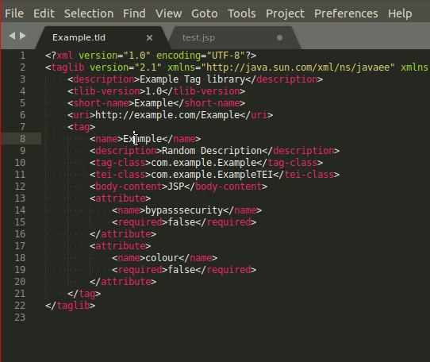

TLD Autocomplete for Sublime Text
===========================================================

Parses a folder of .tld files and turns them into tags including their attributes.

Once parsed this extends the default autocomplete and finds matches when a person opens a tag using '<'.


Install
-------

If you have Package Control installed in Sublime just press ctrl+shift+p (Windows, Linux) or cmd+shift+p (OS X) to open the Command Pallete.

Start typing 'install' to select 'Package Control: Install Package', then search for TLD Autocomplete and select it. That's it.

You can also install this package manually by entering the Packages directory of Sublime Text 2/3 and issuing on a terminal:

    git clone https://github.com/mlew980/sublime-tld


Settings
--------

You will need to specify the location of your .tld files, you can find the settings in the Subline menu under Preferences > Package Settings > TLD Autocomplete > Settings - Default.

Example: the following settings would pull in all the .tld files from the /home/michaell/tlds folder.

```json
{
	"tld_folder_path":"/home/michaell/tld",
	"xml_name_space": "http://java.sun.com/xml/ns/javaee"
}
```

`tld_folder_path` is required for the plugin to function. You must specify the location of all your .tld files - e.g. /home/john/tlds.

`xml_name_space` is used for parsing purposes, the default value is `http://java.sun.com/xml/ns/javaee` but if you're unsure of what this should be for you files, open your .tld file and at the <b>xml</b> declaration at the top you should find an attribute called `xmlns`, copy the value into the setting above.

<b>Please restart Sublime Text after updating settings.</b>

Example Taglib:
```xml
<?xml version="1.0" encoding="UTF-8"?>
<taglib version="2.1" xmlns="http://java.sun.com/xml/ns/javaee" xmlns:xsi="http://www.w3.org/2001/XMLSchema-instance" xsi:schemaLocation="http://java.sun.com/xml/ns/javaee http://java.sun.com/xml/ns/javaee/web-jsptaglibrary_2_1.xsd">
    <description>Example Tag library</description>
    <tlib-version>1.0</tlib-version>
    <short-name>Example</short-name>
    <uri>http://example.com/Example</uri>
    <tag>
        <name>Example</name>
        <description>Random Description</description>
        <tag-class>com.example.Example</tag-class>
        <tei-class>com.example.ExampleTEI</tei-class>
        <body-content>JSP</body-content>
        <attribute>
            <name>bypasssecurity</name>
            <required>false</required>
        </attribute>
        <attribute>
            <name>colour</name>
            <required>false</required>
        </attribute>
    </tag>
</taglib>
```

Once parsed it will display like following:  


LICENSE
-------

MIT License

Copyright (c) 2019 Michael Lewandowski

Permission is hereby granted, free of charge, to any person obtaining a copy
of this software and associated documentation files (the "Software"), to deal
in the Software without restriction, including without limitation the rights
to use, copy, modify, merge, publish, distribute, sublicense, and/or sell
copies of the Software, and to permit persons to whom the Software is
furnished to do so, subject to the following conditions:

The above copyright notice and this permission notice shall be included in all
copies or substantial portions of the Software.

THE SOFTWARE IS PROVIDED "AS IS", WITHOUT WARRANTY OF ANY KIND, EXPRESS OR
IMPLIED, INCLUDING BUT NOT LIMITED TO THE WARRANTIES OF MERCHANTABILITY,
FITNESS FOR A PARTICULAR PURPOSE AND NONINFRINGEMENT. IN NO EVENT SHALL THE
AUTHORS OR COPYRIGHT HOLDERS BE LIABLE FOR ANY CLAIM, DAMAGES OR OTHER
LIABILITY, WHETHER IN AN ACTION OF CONTRACT, TORT OR OTHERWISE, ARISING FROM,
OUT OF OR IN CONNECTION WITH THE SOFTWARE OR THE USE OR OTHER DEALINGS IN THE
SOFTWARE.
